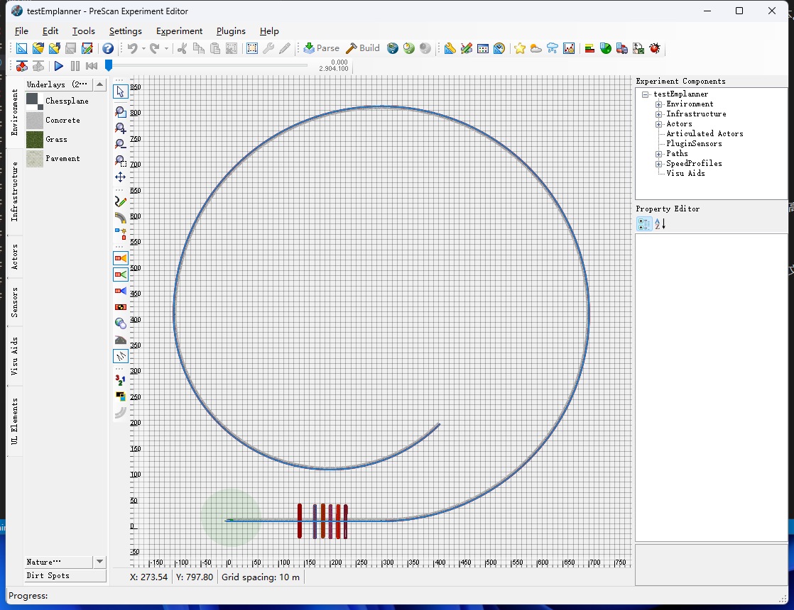
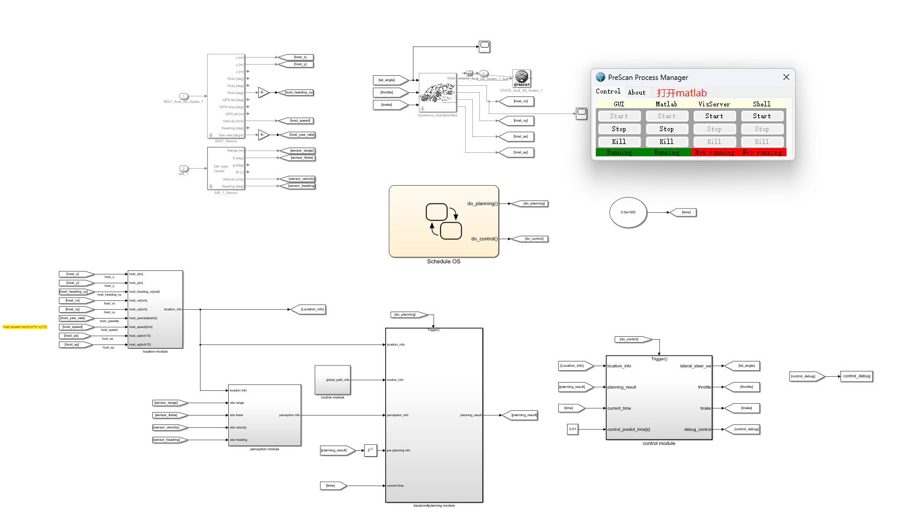
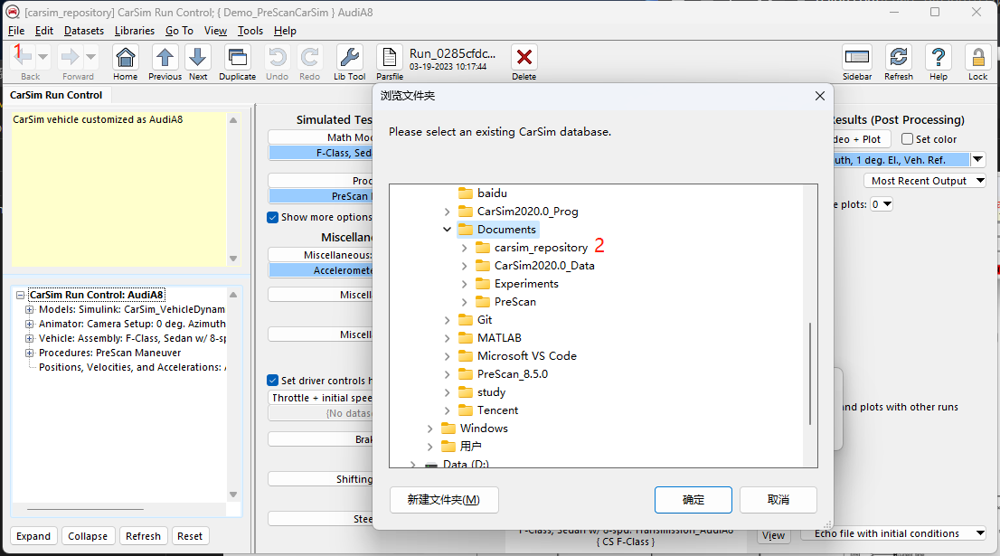
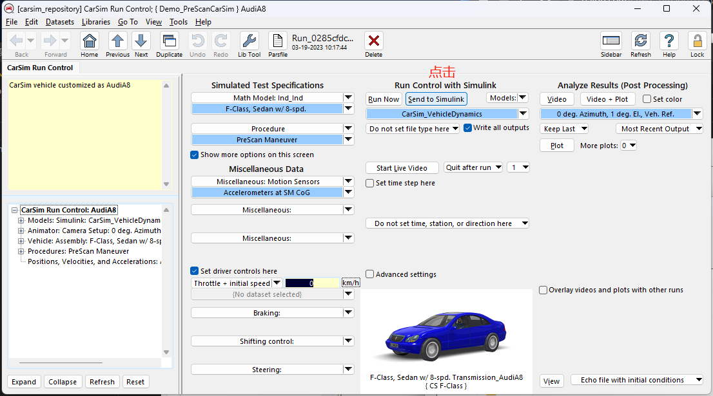
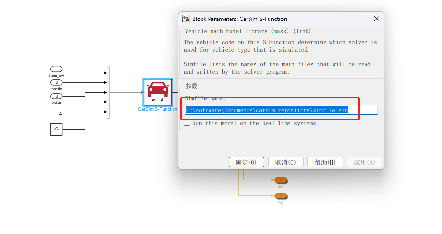
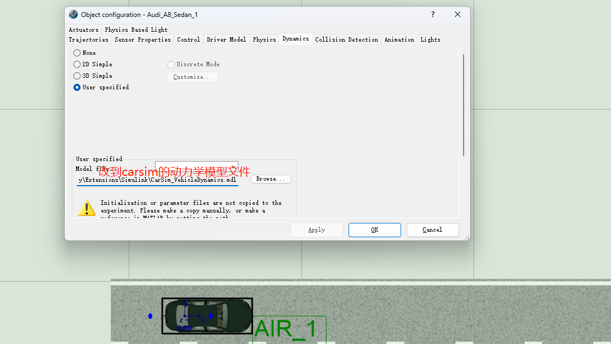
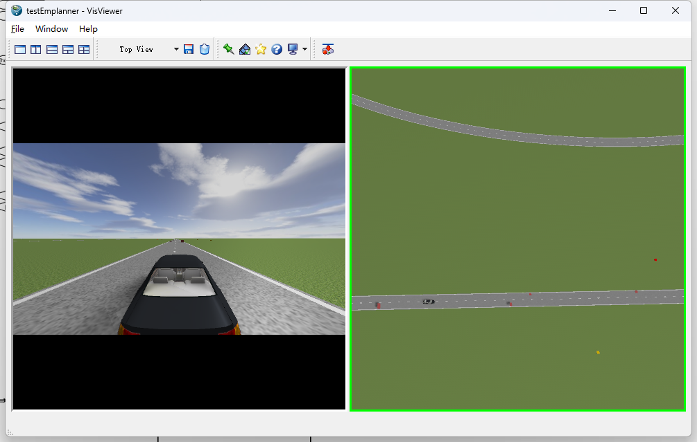

Emplanner_matlab

详细的看 main_13700k 分支 readme说明

#### 背景

    本项目为Emplanner 复现仓库，主要复现b站上老王的教程,强烈推荐大家去学习,参考链接：https://space.bilibili.com/287989852/?spm_id_from=333.999.0.0

#### 安装

    运行本项目需要安装以下软件，方便大家下载，附上百度网盘链接，注意要使用对应的版本。

    依赖的软件：

    matlab 2021b：链接：https://pan.baidu.com/s/1dRnDzgNScp-LHJBj2vrexw
提取码：aczw

    carsim 2020 ：链接：https://pan.baidu.com/s/1YW9CwQ5pIigcxy2CqUjIaA
提取码：igsj

    prescan 8.5 : 链接：https://pan.baidu.com/s/11nK_9ZiIOWHjujkFrN8rOA
提取码：mouz

具体安装教程参考百度，需要注意：配置matlab的c编译器（推荐vs2022），prescan版本太高会导致无法使用传感器。

#### 使用

1. 克隆本仓库，本仓库为prescan的项目工程，用prescan加载后，用prescan打开matlab文件即可，第一次打开matlab会编译prescan的项目。

2.克隆本项目的另一个carsim的仓库，仓库地址：在本项目下 git@github.com:gcx2020/carsim_repository.git

    用carsim2020打开，找到对应的data-set，然后点击send_to_simulink,即可。

3.需要更改matlab模型中，carsim的文件路径，如下所示

更改prescan中依赖的文件路径,如下所示：

#### 效果

最终run，可以看到如下的效果，本模型所有可见的bug都修复了，算力比较好（13700k+32G），可以路径规划，静态障碍物+动态障碍物一起实现。

